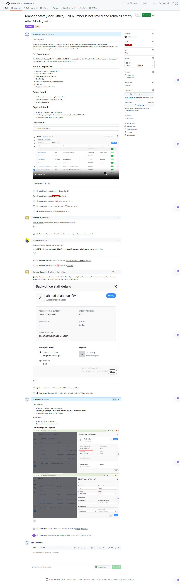

<h1 align="center">Hi 👋, I'm Rida Khan</h1>
<h3 align="center">Software Quality Assurance (SQA) Engineer | Automation & API Testing Enthusiast</h3>

  

---

### 🌟 About Me
I am a detail-oriented Software Quality Assurance (SQA) Engineer with a strong foundation in both Manual and Automation testing. I specialize in designing comprehensive test plans, executing automation scripts using Playwright, and validating APIs via Postman. Additionally, I have a keen interest in Data Analytics, leveraging SQL and Power BI to derive actionable insights from testing data.

---

### 🛠️ Tech Stack & Tools

  
  
  
  
  
  

---

### 💼 Featured Projects & Artifacts

#### 🐞 1. Manual Testing & Bug Reporting 
*   **Description:** Conducted end-to-end manual testing for the different application. Identified, documented, and tracked critical bugs.
*   **Artifacts:** Test Scenarios, Detailed Test Cases, and comprehensive Bug Reports.
*   **Visual Proof:**
     
    

      
    

    🔗 **https://github.com/Rida-Khan08/SQA-Portfolio/tree/main/Real-Time-Project-Work**

#### 🤖 2. E2E Automation Suite (Playwright)
*   **Description:** Developed a robust End-to-End automation framework using Playwright to reduce regression testing time.
*   **Tech Used:** Playwright, JavaScript/TypeScript, Page Object Model (POM).
*   **Visual Proof:**
    

      
    

    🔗 **https://github.com/Rida-Khan08/playwright-e2e-suite**

#### 🔌 3. API Testing (Postman Collections)
*   **Description:** Validated RESTful APIs for various applications, ensuring data integrity, correct status codes, and optimal response times.
*   **Artifacts:** Automated API test scripts, Environment setups, and Collection Runners.
*   **Visual Proof:**
    

     open link: https://www.notion.so/MY-SQA-PORTFOLIO-350e728b54fb805c9a67c77b9442d93a?source=copy_link 
    

### 📈 GitHub Stats

  
  

---

### 📫 Let's Connect

  ridakhan.0802@gmail.com

  <em>"Quality is never an accident; it is always the result of intelligent effort."</em>

